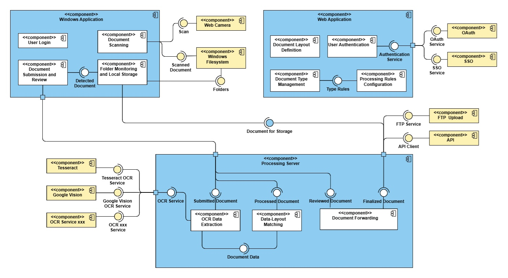

# docflow-admin
> Document processing system

This repository contains the source code for Admin Web Application (React) for a document processing system. The web app is a dashboard for administrators to set up destinations for different file types and to define layouts for a Processing Server. The Server interacts with a client app for Windows Desktop. The Processing Server and Windows App are developed separately as [si-docflow-server](https://github.com/kanitakadusic/si-docflow-server) and [si-docflow-windows](https://github.com/kanitakadusic/si-docflow-windows).

## Architecture 🗂️

The component diagram of the system is provided below.<br><br>




## How To Use ⚙️

Prerequisite - [**Node.js + npm**](https://nodejs.org/en) & [**Git**](https://git-scm.com/)

```
# Clone this repo:
$ git clone https://github.com/HarisMalisevic/si-docflow-admin.git

# After cloning is done, go into the project directory with
$ cd si-dockflow-admin

# Install npm dependencies with
$ npm run dependencies

# Build project
$ npm run build
```

The previous two commands are shortcuts for longer commands.
For the build command, it runs ```cd backend && npm run build && cd ../frontend && npm run build```.
Other shortcuts like this one are defined in ```package.json``` files under ```"scripts"```.

## How to start?

1. After building the app, navigate to the project root folder ```/si-docflow-admin```.
2. Start the web app and server with: ```npm run start```

This will make a local server on http://localhost:5000/.
